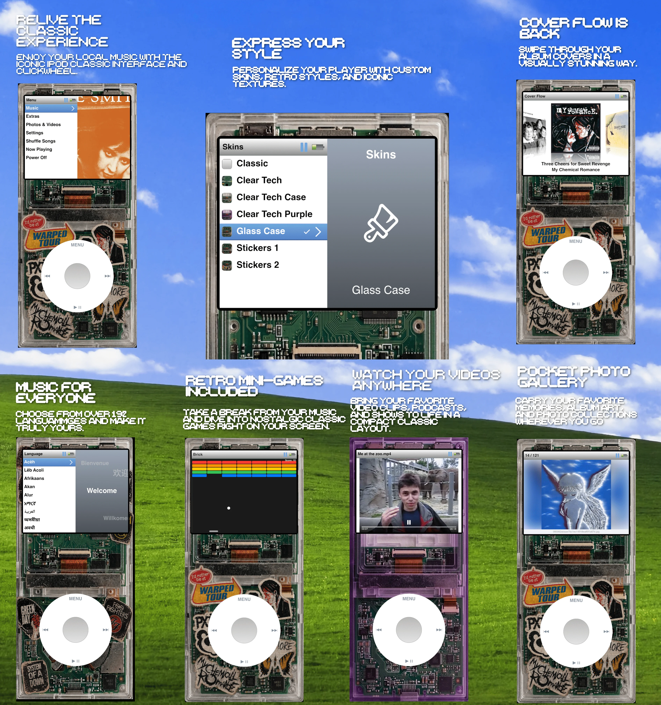

<div align="center">

# RetroPod



Introducing "RetroPod" - Your Timeless Audio Experience

Step back in time with RetroPod, a local music player app designed to capture the nostalgic essence
of the iconic iPod Classic. Immerse yourself in the familiar click wheel interface and relive the
joy of navigating your music library with a touch of retro charm.

</div>

**Intuitive Navigation:** Navigate through your music library effortlessly using the virtual click
wheel. Scroll, click, and feel the tactile response as you rediscover the joy of selecting your
favorite tracks with the same ease as the original iPod.

**Local Music Library:** RetroPod is focused on your locally stored music files, ensuring that your
personal music collection takes center stage. Organize your tracks, albums, and playlists just like
you did on your trusty iPod Classic.

**Customizable Themes:** Personalize your RetroPod experience with the option of silver or grey
device frame. Choose from the two different color schemes to tailor the app's appearance to your
unique style.

**Interchangeable Skins:** Give your device a fresh look by switching between multiple removable
skins, from classic glass cases to vibrant stickers, all configurable from the settings.

**Cover Art Display:** Immerse yourself in your music by appreciating album artwork on the vibrant
display. RetroPod pays homage to the visual appeal of classic iPods by showcasing your favorite
album covers in a retro-inspired format.

**Built-in Minigames:** Take a break from your playlist with classic iPod-style minigames, including
Brick and a Music Quiz, all playable directly from the device screen.

**Photos and Videos:** View photos and watch videos stored on your device. Browse through your
library, open the built-in photo viewer, or play back videos with the dedicated player.

**No Frills, Just Music:** RetroPod stays true to the essence of a music player - no distractions, no
unnecessary features. Focus solely on the joy of listening to your favorite tunes without the
complexities of a modern streaming service.

**Offline Listening:** Enjoy your music without relying on an internet connection. RetroPod is
perfect for those moments when you want to disconnect and savor the tunes stored locally on your
device.

Relive the magic of the iPod Classic with RetroPod - where timeless design meets the convenience of
today. Download now and embark on a journey down memory lane with your music in the palm of your
hand.

If you like what you see, please star the repo.

## Features

- Plays MP3, WAV, FLAC, M4A, MP4, Ogg, Opus, AAC, AIFF, APE, and MOV audio
- Choose a Custom Folder To Scan Music From (By Default it is the Device Music Folder in the root folder
  of the device)
- Multiple Ipod Classic Device Colors (Silver and Black)
- Interchangeable Device Skins (Glass cases, Stickers, and more)
- Displays the Music Metadata (Album Art, Artist Names)
- Ability to seek forward and backwards on a audio file (By Long Pressing the seek
  forward/backwards buttons)
- Ability to go to previous and next track in the playlist
- Ipod Classic User Interface
- Cover Flow View
- Click Wheel with Scrollable Rotation Enabled
- Now Playing Screen with current music progress displayed
- Songs Screen with all the possible songs from the selected directory
- Ability to Filter and Select From a Particular Artist, Album or Genre
- Responsive Design For all Different Types of Screen Sizes
- Displays the current device battery level and charging status on the status bar
- Background Playback with Notification Control
- Shuffle Songs Feature
- Loop Songs Feature (Loop one song or an entire playlist)
- Click Wheel Sounds
- Vibration when clicking buttons and scrolling through the scroll wheel
- In App Volume Control
- Reflective Cover Art
- About Screen
- Multi Language Support (Over 197 Languages Supported)
- Touch Screen Support
- Split Screen View (6th and 7th Gen iPod Classic)
- Ability to search songs, artists, playlists and albums
- Caching Metadata of the songs for faster boot up times
- Ability to Create and Store Custom User Created Playlists
- App Usage Tutorial
- Song Rating Feature
- Displays embedded lyrics in Now Playing
- Built-in Minigames (Brick and Music Quiz)
- Photo Viewer to browse photos stored on the device
- Video Player to watch videos stored on the device
- Ability to scan custom folders for photos and videos

### Supported audio formats

RetroPod imports a format when its metadata can be read and at least one
configured playback backend can play it. Playback availability therefore varies
by platform:

| Format         | Extensions               | Expected playback                               |
| -------------- | ------------------------ | ----------------------------------------------- |
| MP3            | `.mp3`                   | Android, iOS, Windows, Linux, web               |
| PCM WAV        | `.wav`                   | Android, iOS, Windows, Linux, web               |
| FLAC           | `.flac`                  | Android, iOS, Windows, Linux, major browsers    |
| AAC in MP4     | `.m4a`, `.mp4`           | Android, iOS, Windows, Linux, major browsers    |
| Ogg Vorbis     | `.ogg`                   | Android, Windows, Linux, supporting browsers    |
| Ogg Opus       | `.opus`                  | Android, Windows, Linux, supporting browsers    |
| Raw ADTS AAC   | `.aac`                   | Android, iOS, Windows, Linux; browser-dependent |
| AIFF / AIFF-C  | `.aif`, `.aiff`, `.aifc` | iOS, Windows, Linux                             |
| Monkey's Audio | `.ape`                   | Windows, Linux                                  |
| QuickTime      | `.mov`                   | iOS, Windows, Linux; browser-dependent          |

## Installation links

<table>
  <tr>
    <th>Platform</th>
    <th>Installation Links</th>
  </tr>
  <tr>
    <td>Android</td>
    <td>
      <a href="https://github.com/RchrdAriza/RetroPod/releases/latest/download/RetroPod-Android.apk">
        
      </a>
    </td>
  </tr>
</table>

## Plugins

| Name                                                                                          | Usage                                                                               |
| --------------------------------------------------------------------------------------------- | ----------------------------------------------------------------------------------- |
| [**audio_metadata_reader**](https://pub.dev/packages/audio_metadata_reader)                   | To read the metadata of the local mp3 files                                         |
| [**audio_service**](https://pub.dev/packages/audio_service)                                   | To support background audio playback                                                |
| [**battery_plus**](https://pub.dev/packages/battery_plus)                                     | Shows phone battery level and status                                                |
| [**cupertino_icons**](https://pub.dev/packages/cupertino_icons)                               | For ios style icons                                                                 |
| [**device_preview_plus**](https://pub.dev/packages/device_preview_plus)                       | For visualizing how the app looks on different devices and screens                  |
| [**disable_battery_optimization**](https://github.com/adeeteya/Disable-Battery-Optimizations) | To Disable vendor or android specific battery optimizations for background playback |
| [**file_picker**](https://pub.dev/packages/file_picker)                                       | To select the directory from which the music files are scanned                      |
| [**flutter_localizations**](https://pub.dev/packages/flutter_localizations)                   | For in-app localization map data                                                    |
| [**flutter_riverpod**](https://pub.dev/packages/flutter_riverpod)                             | For State Management                                                                |
| [**go_router**](https://pub.dev/packages/go_router)                                           | To handle routing within the app                                                    |
| [**hive_ce**](https://pub.dev/packages/hive_ce)                                               | To Cache Auio Metadata and store playlists                                          |
| [**hive_ce_flutter**](https://pub.dev/packages/hive_ce_flutter)                               | For flutter specific libs of hive                                                   |
| [**intl**](https://pub.dev/packages/intl)                                                     | For internalization and localization of the app                                     |
| [**just_audio**](https://pub.dev/packages/just_audio)                                         | To play audio files                                                                 |
| [**just_audio_background**](https://pub.dev/packages/just_audio_background)                   | To control audio through media notification                                         |
| [**just_audio_media_kit**](https://pub.dev/packages/just_audio_media_kit)                     | To play audio files on Windows and Linux                                            |
| [**media_kit_libs_linux**](https://pub.dev/packages/media_kit_libs_linux)                     | Media kit Libraries for Linux                                                       |
| [**media_kit_libs_windows_audio**](https://pub.dev/packages/media_kit_libs_windows_audio)     | Media kit Libraries for Windows                                                     |
| [**on_audio_query**](https://github.com/adeeteya/on_audio_query)                              | To fetch all the music files from Android and iOS                                   |
| [**path_provider**](https://pub.dev/packages/path_provider)                                   | To fetch app data directories                                                       |
| [**permission_handler**](https://pub.dev/packages/permission_handler)                         | To check and request for file and audio access permissions                          |
| [**shared_preferences**](https://pub.dev/packages/shared_preferences)                         | To store system settings                                                            |
| [**tutorial_coach_mark**](https://pub.dev/packages/tutorial_coach_mark)                       | To provide app tutorial to the users                                                |
| [**universal_html**](https://pub.dev/packages/universal_html)                                 | For Launching the app in full-screen mode on web versions                           |
| [**url_launcher**](https://pub.dev/packages/url_launcher)                                     | For Launching the Donation Page Link                                                |
| [**vibration**](https://pub.dev/packages/vibration)                                           | Used for vibration while using device controls                                      |
| [**vibration_web**](https://pub.dev/packages/vibration_web)                                   | Used for vibration on the webapp version                                            |
| [**build_runner**](https://pub.dev/packages/build_runner)                                     | For code generation                                                                 |
| [**custom_lint**](https://pub.dev/packages/custom_lint)                                       | For using custom lint rules                                                         |
| [**flutter_lints**](https://pub.dev/packages/flutter_lints)                                   | For using recommended flutter lints                                                 |
| [**flutter_test**](https://pub.dev/packages/flutter_test)                                     | For unit and widget testing the app                                                 |
| [**hive_ce_generator**](https://pub.dev/packages/hive_ce_generator)                           | For automatically generating Hive TypeAdapters                                      |
| [**riverpod_lint**](https://pub.dev/packages/riverpod_lint)                                   | For using riverpod specific linting rules                                           |

## Reproducible builds

Android release builds are reproducible: building twice with

```
flutter build apk --release --no-pub --suppress-analytics \
  --flavor=production --target=lib/main.dart
```

produces byte-identical APKs (verified with `scripts/verify_reproducible_build.sh`).
Do not pass `--obfuscate` or `--split-debug-info` to the Android build, as they
break reproducibility (the Fastfile keeps them opt-in via `obfuscate: true`).

For F-Droid, a reproducible build requires matching toolchain versions, so the
build recipe must pin the same Flutter/Dart, Gradle and JDK used for the release
(see `pubspec.yaml` and `android/gradle/wrapper/gradle-wrapper.properties`).

## Release and tags

Each release must be tagged at the commit that bumps `pubspec.yaml` (e.g. tag
`1.13.0` at version `1.13.0+26`). Tags are created by the CI workflow
(`.github/workflows/build-and-deploy.yaml`) via `gh release create`.

## Author

Original author: **[Aditya R](https://github.com/adeeteya)**

Maintained and updated by: **[Richard Ariza](https://rchrdariza.dev)**

## License

Modifications and original contributions in this fork are licensed under the
[MIT License](https://github.com/RchrdAriza/RetroPod/blob/master/LICENSE).

This project is a fork of [ClassiPod](https://github.com/adeeteya/Classipod)
(copyright (c) 2025 Aditya R), whose original code remains licensed under the
[BSD-4-Clause License](https://github.com/RchrdAriza/RetroPod/blob/master/LICENSE-CLASSIPOD).
See [NOTICE](https://github.com/RchrdAriza/RetroPod/blob/master/NOTICE) for details.

## Attributions

<a href="https://www.flaticon.com/free-icons/ipod" title="ipod icons">Ipod icons created by
Freepik - Flaticon</a>
